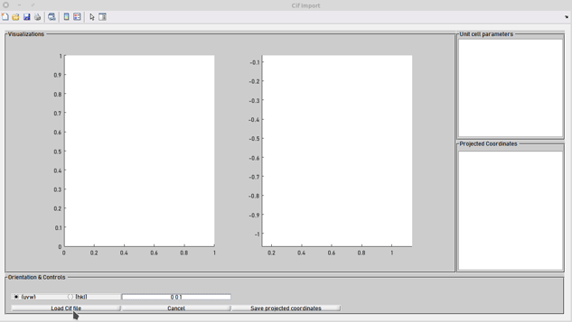
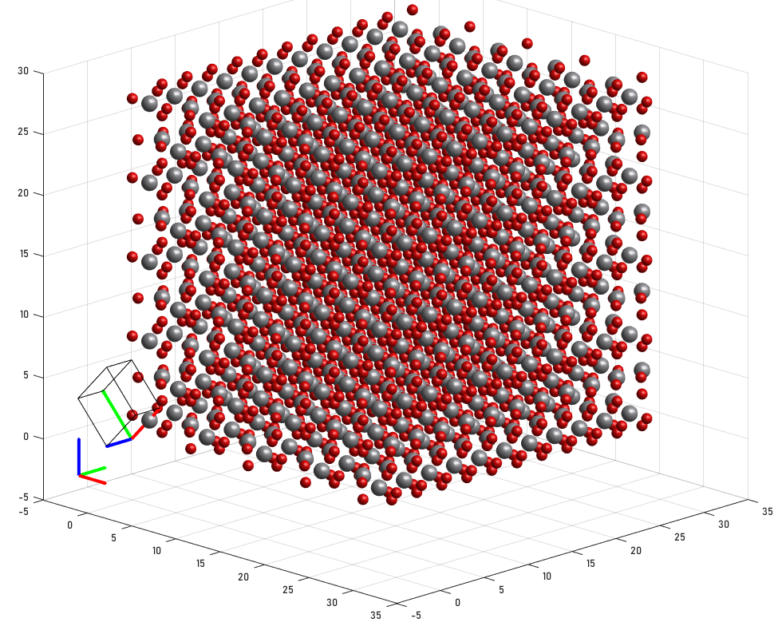

# specimen_creation_cif_gui
This repository contains 2 main contributions:
 ### Create projected unit cells (StatSTEM)
 - Interface for cif-files
 - GUI interface to compute projected unit cell coordinates for a given orientation
 - Exports StatSTEM database files to be used for column indexing
 - Can export projected coordinates as .mat  
 - To run the GUI run: [load_cif_gui();](src/load_cif_gui.m)
  

### Create atomic bulk specimen (MULTEM)
 - Interface for cif-files
 - Workflow to create atomic bulk specimen from cif-files in any orientation 
 - Intended to be used with MULTEM 
 - To create bulk specimen for multem refer to [example_create_specimen](example_create_specimen.m)

